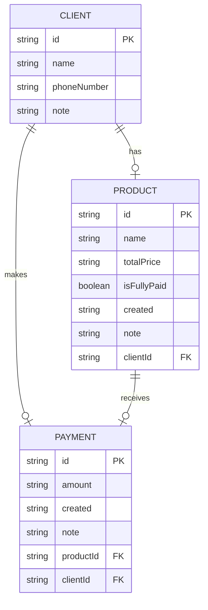

# TriMange


**TriMange** is a mobile application designed to assist small business owners in managing three fundamental aspects of their operations: clients, products, and payments. It helps streamline client management, track products associated with each client, and handle client-related payments efficiently.

---

## Table of Contents

1. [Overview](#overview)  
2. [Motivation](#motivation)  
3. [Tech Stack](#tech-stack)  
4. [Installation & Usage](#installation--usage)  
5. [Design & Architecture](#design--architecture)  
6. [To-Do / Roadmap](#to-do--roadmap)  

---

## Overview

**TriMange** is a comprehensive mobile solution for small business owners who need efficient tools to manage clients, track products, and handle payments seamlessly. It offers an intuitive and simple interface, real-time updates, and integrations to ensure smooth business operations.

### Features

- **Client Management**: Store and manage client details with ease.  
- **Product Tracking**: Link products to specific clients and track them effortlessly.  
- **Payment Management**: Log, track, and manage payments related to each client.  
- **Real-time Updates**: Keep your data synchronized and up-to-date with Firebase.  
- **Multi-Language Support**: Available in multiple languages using i18n-js.  

---

## Motivation

Managing clients, products, and payments manually can be time-consuming and error-prone for small business owners. **TriMange** addresses these challenges by providing an all-in-one mobile application to streamline these essential tasks, reducing administrative overhead and improving efficiency.

---

## Tech Stack

### Frontend & Mobile

-  **Framework**: React Native (Expo + TypeScript)  
-  **Routing**: Expo Router  
-  **State Management**: Redux Toolkit  
-  **UI Components**: Expo Vector Icons, React Native Gesture Handler  

### Backend & Services

-  **Database**: Firebase  
-  **Storage**: React Native Async Storage  
-  **Localization**: i18n-js  

---

## Installation & Usage

⚠️ **Warning**: The application is cross-platform, meaning it works for **web**, **Android**, and **iOS**. However, most development and testing have been focused on **Android**, so the web and iOS versions may not be fully optimized or thoroughly tested.

⚠️ **Note**: The project is expected to work on **GNU/Linux** without issues. However, it has not been tested on **Windows** or **macOS**.

---

### Prerequisites

Before you get started, ensure you have the following installed:

- **Node.js** (version 18 or higher) – [Download Node.js](https://nodejs.org/)  
  Alternatively, use [fnm](https://github.com/Schniz/fnm) to manage different Node.js versions on your machine.

- **Android Studio** for mobile development – [Download Android Studio](https://developer.android.com/studio)  
  - **Android Studio Emulator** for running Expo projects – [Setup Guide](https://docs.expo.dev/workflow/android-studio-emulator/)

- **Git** – [Download Git](https://git-scm.com/) for version control.

---

### Installation Steps

1. **Clone the Repository**  
   Open a terminal and run the following commands:

   ```bash
   git clone https://github.com/mohamedhany01/tri-mange.git
   cd tri-mange
   ```

2. **Install Dependencies**  
   Install the required packages using `npm`:

   ```bash
   npm install
   ```

3. **Set Up Environment Variables**  

    Create a `.env` file in the root directory of your project and add your Firebase project settings. You can find these settings in the [Firebase Console](https://support.google.com/firebase/answer/7015592).

    Add the following environment variables to the `.env` file:

    ```env
    EXPO_PUBLIC_FIREBASE_API_KEY=your-api-key
    EXPO_PUBLIC_FIREBASE_AUTH_DOMAIN=your-auth-domain
    EXPO_PUBLIC_FIREBASE_PROJECT_ID=your-project-id
    EXPO_PUBLIC_FIREBASE_STORAGE_BUCKET=your-storage-bucket
    EXPO_PUBLIC_FIREBASE_MESSAGING_SENDER_ID=your-messaging-sender-id
    EXPO_PUBLIC_FIREBASE_APP_ID=your-app-id
    EXPO_PUBLIC_FIREBASE_MEASUREMENT_ID=your-measurement-id

    # Proxy endpoint
    EXPO_PUBLIC_PROXY_ENDPOINT=endpoint-link
    ```

    ---

    ⚠️ **Security Note**  

    Firebase is a serverless platform, and according to the [Firebase documentation](https://firebase.google.com/docs/projects/api-keys#general-info), it is safe to embed the following keys directly in your app:

    - **API Key**  
    - **Auth Domain**  
    - **Storage Bucket**  
    - **Messaging Sender ID**  
    - **App ID**  
    - **Measurement ID**  

    Instead of securing these keys, Firebase Security Rules should be used to control access to your backend. For more details on implementing Firebase Security Rules, refer to the [Firebase Security Rules Guide](https://firebase.google.com/docs/rules).

    ---

    🔧 **Optional: Reverse Proxy Configuration**

    To enhance security further, you can use a **Reverse Proxy** to handle requests and obscure your Firebase keys.

    1. **Enable the Reverse Proxy** by setting the `EXPO_PUBLIC_PROXY_ENDPOINT` in your `.env` file and hardcoding the endpoint in the `fetchFirebaseAppKeys` function.

    2. **Modify the following files** if you want to disable or customize the Reverse Proxy feature:

    - **`utilities/apis/index.tsx`**  
    - **`firebase/configuration.ts`**

    If you decide to set up a standalone Reverse Proxy, initialize `EXPO_PUBLIC_PROXY_ENDPOINT` with your endpoint URL in the `.env` file.

4. **Supported NPM Scripts**

    The project includes several useful scripts to manage development, testing, and deployment. Below is a list of available scripts along with their descriptions.

    | **Script**                  | **Description**                                                                                                         |
    |------------------------------|-------------------------------------------------------------------------------------------------------------------------|
    | **`start`**                 | Starts the Expo development server for mobile and web platforms.                                                       |
    | **`reset-project`**         | Runs a custom script to reset the project (useful for cleaning and resetting local changes).                           |
    | **`android`**               | Runs the app on an Android emulator or physical device in development mode with debugging enabled.                     |
    | **`android:release`**       | Builds and runs a release variant of the Android app. Logs can be viewed using `start:native:logging`.                 |
    | **`ios`**                   | Runs the app on an iOS simulator or physical device.                                                                   |
    | **`web`**                   | Starts the Expo development server for the web platform.                                                               |
    | **`test`**                  | Runs all Jest tests in watch mode for continuous feedback during development.                                          |
    | **`lint`**                  | Checks for code style issues using the linter.                                                                         |
    | **`lint:fix`**              | Automatically fixes linting issues where possible.                                                                     |
    | **`start:native:logging`**  | Displays native Android logs in real-time, useful for debugging native code and issues.                                |
    | **`clear:cache`** *(Linux/WSL2 only)* | Clears the project cache using a custom script. Helps resolve caching issues during development.             |
    | **`clear:build`**           | Cleans previous builds by running `expo prebuild --clean`. Use this after modifying `app.json` configurations.         |

---

## Design & Architecture

The architecture of **TriMange** leverages **Firebase's NoSQL database** to manage key entities: **clients**, **products**, and **payments**. The design is simple yet powerful and scalable, taking advantage of NoSQL's flexibility. By using small documents and large collections, the database remains efficient and easy to scale.

### Key Relationships

- **Client ↔ Product**: One client can be associated with multiple products.
- **Client ↔ Payment**: One client can make multiple payments.
- **Product ↔ Payment**: One product can be linked to multiple payments.

This approach keeps the NoSQL model **normalized** while maintaining clear relationships through **references** (storing `clientId` and `productId` in related documents). This design ensures easy querying and maintains data integrity.

### Project Structure

The project structure is organized to ensure maintainability and scalability. Here’s a high-level overview of the database schema:

#### Database Diagram

The diagram below illustrates the entities and their relationships:



### Design Considerations

1. **Scalability**  
   - By leveraging Firebase's NoSQL database, the app can scale efficiently by maintaining a structure with small, self-contained documents.
   - Storing references (`clientId` and `productId`) instead of embedding full objects helps avoid data duplication and improves performance when querying large datasets.

2. **Flexibility**  
   - The design supports adding new fields to each entity without major schema changes.
   - Documents can evolve independently, allowing for easy updates and feature enhancements.

3. **Performance**  
   - Query performance is optimized by keeping documents small and utilizing Firebase's indexing capabilities.
   - Using **large collections** ensures that data retrieval remains efficient even as the number of clients, products, and payments grows.

4. **Maintainability**  
   - Clear relationships between entities make the database design intuitive and easier to maintain.
   - The modular approach in the code structure ensures that each entity can be managed independently.

### Code Organization

- **Entities**  
  - `clients`: Stores all client-related data.  
  - `products`: Stores product details linked to specific clients.  
  - `payments`: Stores payment records associated with clients and products.

- **Utilities**  
  - **API Handlers**: Located in `utilities/apis/index.tsx` to handle API interactions.  
  - **Firebase Configuration**: Managed in `firebase/configuration.ts` for easy setup and updates.

This design ensures that the app remains **robust, scalable, and easy to extend** as new features are added.

---

## To-Do / Roadmap

For detailed upcoming tasks, features, and improvements, please refer to the 🔗 [TriMange Project Board](https://github.com/users/mohamedhany01/projects/1/views/3)
